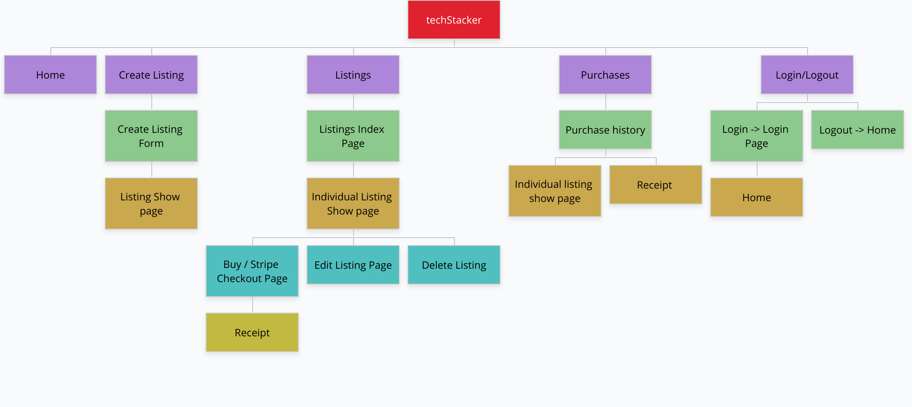
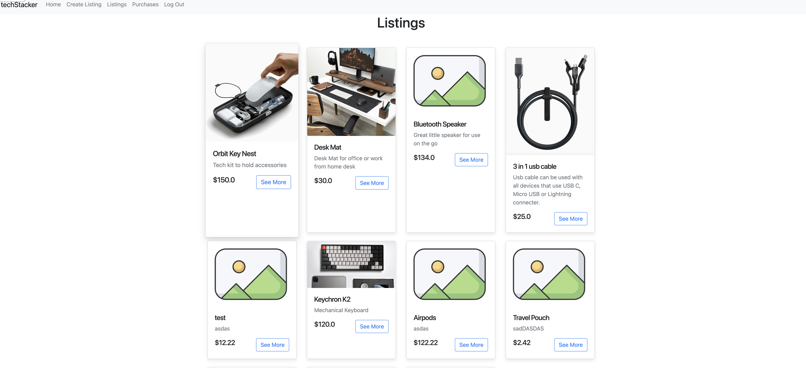
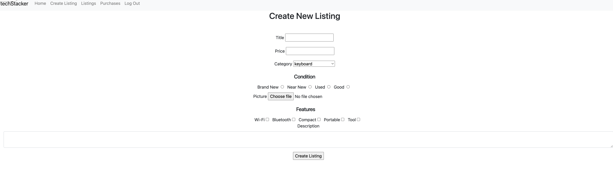
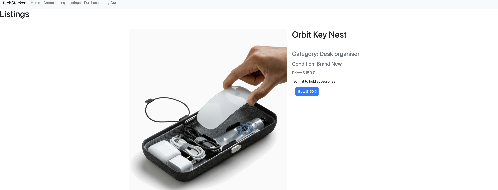
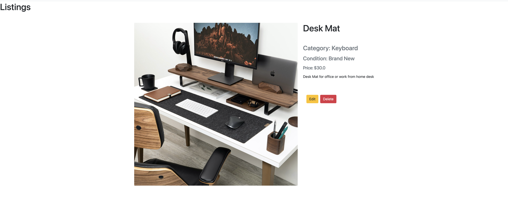
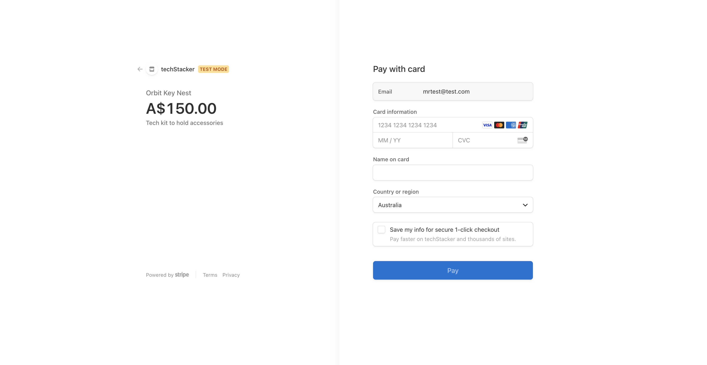
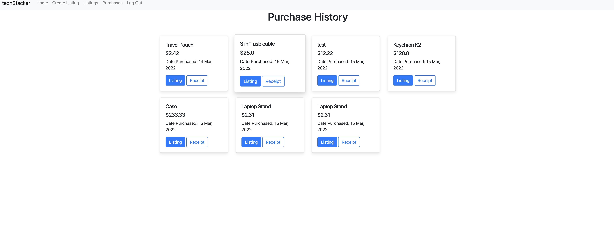
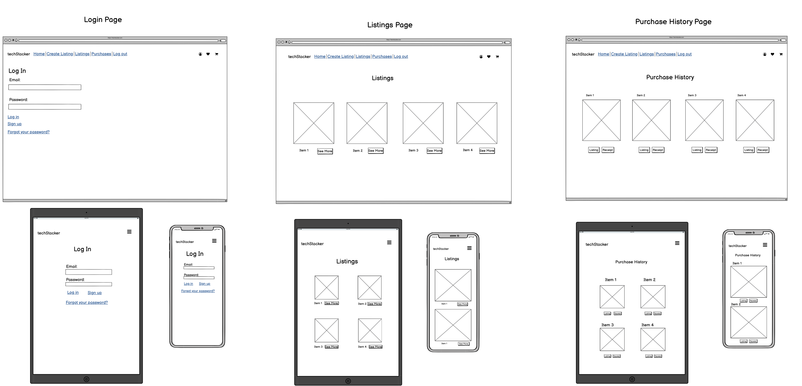
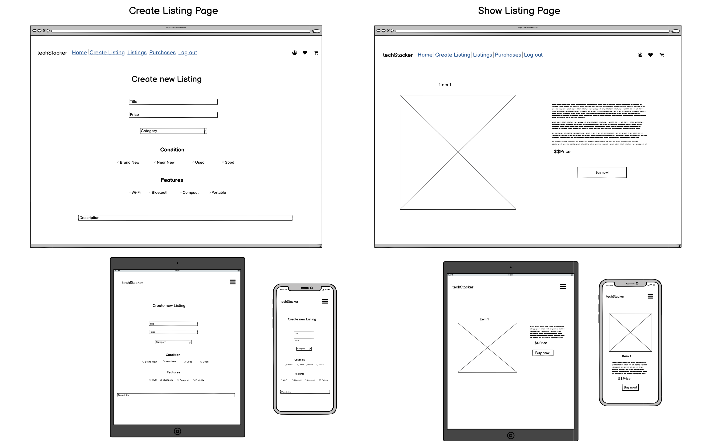

# README

# Identification of the problem being solved.
There are many Market place Applications out there, however at techStacker our focus is the ability to be able to buy and sell Tech gear whether it be new, used, good condition etc, in an easy to use manner with no fee's to use the Web Application, to help more buyers and sellers to connect, while putting their old tech to use without it going to waste.

# Why is it a problem that needs solving?
Our focus is to allow Tech gear to be accessible to everyone. In todays day and age, tech is always evolving and it can be difficult to keep up with all the latest releases of products. New tech products are constantly being purchased by consumers while the old versions of it are collecting dust inside drawers; techStacker will solve this problem of old tech going to waste, by opening up a marketplace for sellers to list their no longer required products for any interested buyers. Because it will have a pure focus of tech gear, it will have the attraction of users to the techStacker application, rather than being overwhelmed by the choice of other martketplace applications that focus on other categories.

# Link to Website:
https://techstacker.herokuapp.com/
# Github Repository:
https://github.com/Krishtronomy/tech-stacker

# Description

### Purpose
The purpose of the application is for users to be able to buy and sell Tech Gear, making it an easy to use platform allowing users to sell their old gear that might not be used anymore. Allowing for a recycle of products (one mans trash is another mans treasure).

### Functionality / features
The Marketplace application has the ability to sign up and login as a user, which then allows you to buy or sell without the need for multiple accounts. Only users who have listed a listing for sale, can edit or delete the listing. A listing can be created through the "Create Listing" tab and a form can be filled out to create the listing, also allowing a image to be uploaded. Once a listing is bought, it gets marked as 'sold'. The buyer has the ability to buy listings and checkout using Stripe, which then also provides a purchase receipt. Users also have the ability to view their purchase history under "Purchases" which displays the listing names, price and purchase date, which requires a user to be logged in to view. All listings can be viewed from the "Listings" tab regardless of whether they are logged in or not.

### Sitemap

### Screenshots

Homepage

Listing Page

Create Listing Page

Show Listing Page

Edit/Delete Listing

Checkout Page

Purchases Page

### Target audience
The Target audience for the Martetplace application is for users who like tech products such as desk organisers, accessories, nifty products, phone/tablet accessories, home office gear and anything in between. Its a place where you can list your old tech that is not getting any more use, knowing it will go to a good home while also making a quick buck, and on the other end for buyers interested in these products.

### Tech stack
- HTML & CSS
- SASS and Bootstrap
- Ruby
- Ruby on Rails
- Javascript
- Stripe (payments)
- AWS S3 Storage (Image upload)
- Heroku (deployment)

### Third Party Services
The app will use Stripe for payments processing and for issuing receipts, this will be implemented through the Stripe API and webhooks. AWS S3 Storage will be used for image storage for when users upload images to the website. Github is being used for version control. Heroku is being used for deployment of the website, with staging and production pipelines to allow for efficiency of deployment.

# User Stories
- "As a consumer of tech products, I want an easy to use platform where I can search for tech gear, without being overwhelmed with options on other types of products, so that I can quickly find what I am looking for."
- "As a user, I want to sign up easily without spending too much time, so I can get to listing or buying products."
- "As a user, I want to be able to Login/Logout whenever I want"
- "As a user, I want one single account to be able to buy or sell, so that I dont have to create multiple accounts or use multiple email addresses."
- "As a user, I want to list items for sale easily, so that I can spend less time on admin, and more time listing more items."
- "As a user, I want to attach pictures to my listing, so I can attract buyers."
- "As a user, I want to add a title, price, category, condition, features and a description about my product, so that I can be as informative about my listing as possible."
- "As a user, I want to be able to edit or delete my listing, so that I can adjust prices or listing details whenever required."
- "As a user, I want to view multiple listings easily with a card-like view to give me enough detail about the listing, so that I can easily identify which listings interest me."
- "As a user, I want to be able to click on a listing to view more details and proceed to buy the listing straight away, so that I can easily checkout if I have decided on my purchase."
- "As a user, I want to use a secure payment gateway and have multiple payment options, so that my details remain secure and have multiple options for paying."
- "As a user, I want to be able to view my previous purchases and receipts, so that I can keep a track of my orders."
- "As a user, I want to be able to view my sold items, so that I can keep a track of my sold items."
- "As a user, I want to add items to a wishlist/favourites, so that I can keep track of listings I am interested in."
- "As a user, I want to be able to communicate with users, so that I can ask questions about a listing or a order."

# Wireframes
Login, Listings and Purchase History Page:

Create Listing and Show Listing Page:
